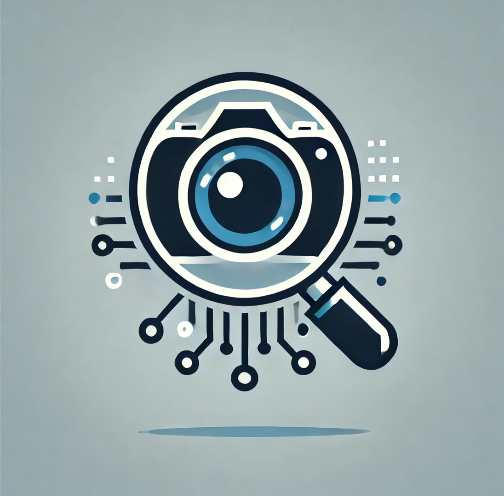

# PhotoCurator.ai
PhotoCurator.ai is a personal project aimed at helping you manage and curate your photo collections more efficiently. By leveraging advanced Image Quality Assessment techniques, the trained AI Model automatically filters out the images that don’t quite make the cut and highlights the ones that do. But the real magic lies in how it adapts to your unique taste in photography.

## What It Does

* **Personalized Image Curation:**
PhotoCurator.ai learns from the photos you love. The more you use it, the better it gets at identifying the qualities that matter most to you—whether that's perfect composition, vivid colors, or those candid moments that capture something special.

* **Filter Out the Unwanted:**
We all have those photos—blurry shots, awkward angles, or just plain dull. PhotoCurator.ai automatically sifts through your collection and flags these images, so you don’t have to waste time sorting them out yourself.

* **Highlight the Best:**
After filtering, it doesn’t just stop there. PhotoCurator.ai stars the images that align with your idea of quality. Over time, it becomes more attuned to your preferences, making sure the photos you keep are truly the ones you care about.

## Why It’s Different

* **Train It Your Way:**
Unlike some generic photo tools, PhotoCurator.ai is built to learn from you. By training the AI on your specific photosets, you can teach it what makes a photo worth keeping in your eyes. The result? A personalized curator that gets better the more you use it.

* **Adaptable to Your Style:**
Whether you’re into landscapes, portraits, or abstract photography, PhotoCurator.ai can be trained to focus on what’s important to you. It’s not just about technical quality—it’s about the aesthetic and emotional value that only you can define.

## How to Get Started
For now, this project is in its early stages, designed for personal use. But as it grows and improves, it might become something more. If you’re interested in trying it out or even contributing, you’ll find it easy to get started.

* **Train the AI:**
Start by feeding it a rated photoset. This helps the AI learn your preferences.

* **Let It Curate:**
Once trained, let PhotoCurator.ai go through your collections and see how it performs. The more you use it, the more it learns.

* **Refine and Improve:**
As you continue to use the tool, the AI adapts, making it better at selecting the photos that matter to you. As your preferences and photography style change, so will the AI.

## Future Plans
While this is currently a personal tool, I’m open to sharing it more widely once it’s reached a certain level of maturity.
